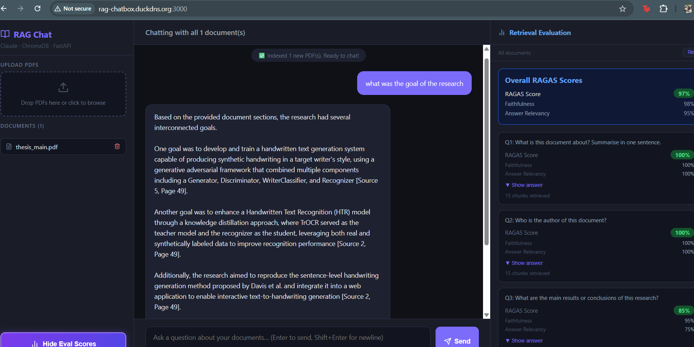

# RAG Document Chat

A full-stack web application that lets you upload PDFs and chat with them using Retrieval-Augmented Generation (RAG). Built with **FastAPI**, **React + Vite**, **ChromaDB**, and **Anthropic Claude**.

---

## Architecture

```
┌───────────────┐     HTTP / SSE     ┌──────────────────────┐     HTTP     ┌────────────┐
│  React + Vite  │ ←───────────────→ │  FastAPI Backend      │ ←──────────→ │  ChromaDB  │
│  (port 3000)   │                   │  (port 8000)          │              │  (port 8001│
└───────────────┘                    │  · PDF parsing        │              └────────────┘
                                     │  · Hybrid chunking    │
                                     │  · ONNX embeddings    │     HTTPS    ┌────────────┐
                                     │  · Streaming chat     │ ←──────────→ │  Anthropic │
                                     │  · RAGAS evaluation   │              │  Claude API│
                                     └──────────────────────┘              └────────────┘
```

---

## Quick Start

### Prerequisites
- Docker and Docker Compose installed
- An Anthropic API key ([get one here](https://console.anthropic.com))

### Steps

```bash
# 1. Clone or unzip the project
cd rag-doc-chat

# 2. Add your API key to the .env file
echo "ANTHROPIC_API_KEY=your_key_here" > .env

# 3. Build and start all services
docker compose up --build

# 4. Open the app
open http://localhost:3000
```

## Output

```

> First build takes a few minutes as it downloads the embedding model. Subsequent starts are fast because the model is cached in the Docker image.

---

## Using the App

### 1. Upload a PDF
Drag and drop a PDF into the upload area on the left sidebar, or click it to browse. A spinning indicator shows while the file is being processed and indexed. You will see a confirmation message once it is ready.

### 2. Chat with your document
Type a question in the input box at the bottom of the chat area and press Enter or click Send. The answer streams in real time with inline citations showing the source file and page number, e.g. `[Source 1, Page 5]`. Click **5 sources retrieved** below any answer to expand and see exactly which pages were used.

### 3. Filter by document
If you have uploaded multiple PDFs, click a document name in the sidebar to filter the chat to that document only. Click it again to deselect. A purple label appears below the list confirming how many documents are active.

### 4. Run the RAG Evaluation
At the **bottom-left of the sidebar** there is a large purple button:

```
 ▌ Show Eval Scores
   Click to run 5 test questions & see scores
```

Click it to open the **Eval Panel** on the right side of the screen. The panel automatically runs 5 hard-coded test questions against your indexed documents and scores each answer using two RAGAS metrics:

- **Faithfulness** — is the answer grounded in what was actually retrieved?
- **Answer Relevancy** — does the answer address the question?

Each question shows the generated answer and its individual scores. Overall averages are shown at the top.

> If you have a document filter active when you click the button, the evaluation runs only against that document. Use the **Re-run** button inside the panel to refresh the scores after changing the filter.

---

## Chunking Strategy

### Method: Adaptive Multi-Strategy Chunking

The chunker automatically detects what kind of document each page contains and routes it to the most appropriate splitting strategy. This means a single upload can contain a research paper, a manual, and a table-heavy appendix and each page is chunked correctly without any configuration.

#### PDF Extraction — pdfplumber

All PDFs are parsed with **pdfplumber** instead of a basic text extractor. pdfplumber detects tables on each page and extracts them as structured pipe-delimited text before the chunking strategies run. This keeps numeric table content intact rather than letting it become jumbled characters that embed poorly.

```
Page with mixed content
        │
        ├─ extract_text()    → body text
        └─ extract_tables()  → "0.847 | 0.812 | 0.791\n..."
                │
                └─ merged into one page text block before chunking
```

#### Strategy Detection

After extraction, every page is analysed with a heading-ratio heuristic. If more than 8% of lines look like section headings (short, title-case or numbered, no trailing period) the page is routed to the **sections** strategy. Everything else goes to the **prose** strategy.

```
_detect_strategy(text)
    │
    ├─ heading ratio > 8%  →  sections  (manuals, technical docs)
    └─ heading ratio ≤ 8%  →  prose     (research papers, reports)
```

#### Strategy 1 — Custom Prose Chunker (research papers)

The original custom paragraph-aware chunker is kept as the prose strategy because it outperforms generic splitters on academic documents.

- Splits text on `\n\n` paragraph boundaries first
- Merges short adjacent paragraphs into one chunk up to `MAX_CHUNK_SIZE`
- Oversized paragraphs fall back to a **sliding window** with sentence-boundary snapping — the window end is snapped to the last `. ` or `\n`, and the next window start is snapped forward to the next word boundary so chunks never begin mid-word

#### Strategy 2 — LangChain Section-Aware Chunker (manuals / technical docs)

For documents with visible section headings, the page is split at each detected heading. The **LangChain `RecursiveCharacterTextSplitter`** then splits each section body using a hierarchy of separators (`\n\n` → `\n` → `. ` → ` `) to keep sentences intact. Every chunk produced is **prefixed with its section heading**, so retrieval always returns the heading alongside the content — a question about "installation steps" retrieves the chunk labelled "3. Installation" rather than a chunk with no context about what section it belongs to.

#### Step — Synthetic front-matter chunk (page 0)

Regardless of strategy, a synthetic "page 0" chunk is always created by concatenating the first 3 pages. This ensures author names, titles, and abstract content are captured together in one retrievable chunk. Without it, a question like "Who is the author?" may retrieve fragmented pieces from different pages and still fail to answer.

#### Visual overview

```
PDF file
   │
   ▼
pdfplumber             ← extract text + format tables as pipe-delimited rows
   │
   ▼
clean_text()           ← fix newlines, remove noise, preserve paragraph breaks
   │
   ▼
_detect_strategy()     ← heading ratio heuristic per page
   │
   ├─ "sections" ──→  detect headings → split body with LangChain RecursiveCharacterTextSplitter
   │                  prepend heading to every chunk for context
   │
   └─ "prose" ────→  split on \n\n → merge short paragraphs
                      oversized paragraph → sliding_window() with word-boundary snapping
   │
   ▼
+ synthetic page 0     ← first 3 pages concatenated
   │
   ▼
embed each chunk       ← BAAI/bge-small-en-v1.5 (ONNX via fastembed)
   │
   ▼
upsert to ChromaDB     ← cosine similarity index
```

#### Chunking parameters

| Parameter | Value | Reason |
|---|---|---|
| `MIN_CHUNK_SIZE` | 200 chars | Discard fragments too short to embed meaningfully |
| `MAX_CHUNK_SIZE` | 1500 chars | Keeps chunks within the embedding model's token window |
| `CHUNK_OVERLAP` | 200 chars | Preserves context across sliding-window split boundaries |
| `TOP_K_RETRIEVE` | 15 | Candidate chunks fetched from ChromaDB per query |
| `TOP_K_RERANK` | 5 | Top chunks passed to Claude as context |

#### Impact on retrieval quality

| Scenario | Adaptive Result | Plain Sliding-Window Result |
|---|---|---|
| "Who is the author?" | Found via page 0 front-matter chunk | Name often split across two chunks |
| "What are the conclusions?" | Conclusion paragraph retrieved intact | Likely split mid-paragraph |
| "What methods were used?" | Full method section with its heading | Fragmented, no section context |
| Tables with numbers | pdfplumber formats rows as text, stays retrievable | Numbers jumbled, embedding match fails |
| Manuals with sections | Heading prepended to every chunk, context preserved | Heading and body separated into different chunks |
| Abstract / intro questions | Covered by page 0 synthetic chunk | Only retrieved if model happens to retrieve pages 1–2 |

#### Alternatives considered

| Strategy | Pros | Cons | Outcome |
|---|---|---|---|
| Fixed-size character sliding window | Simple, predictable | Cuts mid-word and mid-sentence | Kept only as prose fallback for oversized paragraphs |
| Token-based chunking (tiktoken) | Exact token budget | Extra dependency, slower | Overkill for this embedding model |
| Sentence-level chunking | Very granular | Too many tiny chunks, loses paragraph context | High recall, low coherence |
| LlamaIndex SemanticSplitterNodeParser | Groups by meaning | Requires a second full embedding pass, slow, 500 MB extra deps | Not justified for this use case |
| LangChain alone (no custom chunker) | One fewer dependency | Generic splitters underperform on dense academic prose | Custom prose chunker kept as the prose strategy |

---

## Embedding Model

**`BAAI/bge-small-en-v1.5`** via [fastembed](https://github.com/qdrant/fastembed) (ONNX runtime)

- 384-dimensional embeddings
- Runs entirely on CPU via ONNX — no PyTorch, no GPU required
- ~50 MB model size, ~300 MB peak RAM (vs ~1.5 GB for sentence-transformers + PyTorch)
- Strong performance on semantic similarity benchmarks
- Embeddings stored in ChromaDB with cosine similarity

The switch from `sentence-transformers` to `fastembed` was made to reduce memory usage for deployment on free-tier cloud instances (e.g., Oracle Cloud Always Free ARM instances with 24 GB RAM shared across multiple services).

---

## Evaluation — RAGAS-Inspired Scoring

The `/evaluate` endpoint runs **5 hard-coded test questions** against the indexed documents and uses **Claude as an LLM judge** to score two RAGAS metrics per question:

### Metrics

**Faithfulness** — measures whether the answer is grounded in the retrieved context.
- Score of 1.0 means every claim in the answer is directly supported by the retrieved chunks.
- Score of 0.0 means the answer contains claims not found in the context (hallucination).

**Answer Relevancy** — measures how well the answer actually addresses the question.
- Score of 1.0 means the answer is fully on-topic and complete.
- Score of 0.0 means the answer is off-topic or evasive.

**RAGAS Score** — simple average of faithfulness and answer relevancy per question.

**Overall** — mean of all per-question scores across the 5 questions.

### Test Questions

| # | Question | What it tests |
|---|---|---|
| 1 | What is this document about? | General topic retrieval |
| 2 | Who is the author? | Front-matter / metadata retrieval |
| 3 | What are the main results or conclusions? | End-of-document retrieval |
| 4 | What methods or techniques are used? | Method section retrieval |
| 5 | What data or evidence supports the main claims? | Evidence / results retrieval |

### Interpreting scores

| Score range | Meaning |
|---|---|
| 0.90 – 1.00 | Excellent — answers are grounded and on-topic |
| 0.75 – 0.89 | Good — minor gaps or slightly incomplete answers |
| 0.50 – 0.74 | Fair — some answers missing or partially hallucinated |
| Below 0.50 | Poor — retrieval failing or answers not grounded in document |

---

## API Reference

| Method | Endpoint | Description |
|---|---|---|
| `GET` | `/health` | Health check |
| `GET` | `/documents` | List all indexed documents |
| `POST` | `/upload` | Upload one or more PDFs |
| `DELETE` | `/documents/{doc_id}` | Remove a document and its chunks |
| `POST` | `/chat` | Stream a RAG answer (SSE) |
| `GET` | `/evaluate` | Run 5-question RAGAS evaluation |
| `GET` | `/evaluate?doc_ids=a,b` | Evaluate scoped to specific documents |

---

## Tech Stack

| Layer | Technology |
|---|---|
| Frontend | React 18 + Vite |
| Backend | FastAPI + uvicorn |
| Vector DB | ChromaDB 0.5.0 (persistent) |
| Embeddings | `BAAI/bge-small-en-v1.5` via fastembed (ONNX) |
| LLM | Anthropic Claude `claude-sonnet-4-6` |
| PDF parsing | pdfplumber (table-aware extraction) |
| Chunking — prose | Custom paragraph-aware chunker with sliding window |
| Chunking — sections | LangChain `RecursiveCharacterTextSplitter` |
| Containerization | Docker Compose |
| Reverse proxy | nginx (with 50 MB upload limit) |

---

## Project Structure

```
rag-doc-chat/
├── docker-compose.yml
├── .env                        ← ANTHROPIC_API_KEY goes here
├── README.md
├── backend/
│   ├── Dockerfile
│   ├── requirements.txt
│   ├── config.py               ← All constants and env vars
│   ├── state.py                ← Global singletons (embedder, db, client)
│   ├── chunker.py              ← PDF extraction, text cleaning, chunking
│   ├── retriever.py            ← Embed, RAG stream, RAG answer
│   ├── evaluator.py            ← RAGAS scoring and evaluation runner
│   └── main.py                 ← App setup, startup, route handlers
└── frontend/
    ├── Dockerfile
    ├── nginx.conf
    ├── package.json
    ├── vite.config.js
    ├── index.html
    └── src/
        ├── main.jsx
        └── App.jsx             ← Full React UI
```

---

## Common Commands

```bash
# Start everything (first time or after code changes)
docker compose up --build

# Restart only the backend (after backend code changes)
docker compose up --build backend

# Restart only the frontend (after UI changes)
docker compose up --build frontend

# Stop all services
docker compose down

# Stop and remove all data (uploads + vector DB)
docker compose down -v
```
