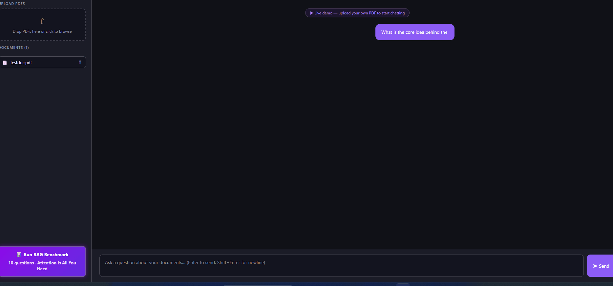

# RAG Document Chat

A production-deployed RAG application that lets you upload PDFs and chat with them using Retrieval-Augmented Generation. Built with **FastAPI**, **Vanilla HTML/JS**, **Qdrant Cloud**, and **Anthropic Claude**.

---

## Architecture

```
┌─────────────────┐     HTTP / SSE     ┌──────────────────────────┐     HTTPS    ┌─────────────────┐
│  Vanilla HTML/JS │ ←───────────────→ │  FastAPI Backend          │ ←──────────→ │  Qdrant Cloud   │
│  nginx (port 80) │                   │  (port 8000)              │              │  (vector DB)    │
└─────────────────┘                    │  · pypdf text chunking    │              └─────────────────┘
                                       │  · pymupdf image extract  │
                                       │  · BGE ONNX embeddings    │     HTTPS    ┌─────────────────┐
                                       │  · Hybrid BM25 + RRF      │ ←──────────→ │  Anthropic      │
                                       │  · LLM reranking          │              │  Claude API     │
                                       │  · Streaming chat         │              └─────────────────┘
                                       │  · RAGAS evaluation       │
                                       └──────────────────────────┘
```

---

## Live Demo



---

## Quick Start

### Prerequisites
- Docker and Docker Compose installed
- An Anthropic API key ([get one here](https://console.anthropic.com))
- A Qdrant Cloud account with a free cluster ([get one here](https://cloud.qdrant.io))

### Steps

```bash
# 1. Clone the project
cd rag-doc-chat

# 2. Create your .env file
cp .env.example .env
# Fill in the three required keys

# 3. Build and start all services
docker compose up --build

# 4. Open the app
open http://localhost:3000
```

### Environment Variables

```env
ANTHROPIC_API_KEY=sk-ant-...
QDRANT_URL=https://xxxx.eu-central-1-0.aws.cloud.qdrant.io
QDRANT_API_KEY=your_qdrant_api_key
```

**Getting your Qdrant credentials:**
1. Go to [cloud.qdrant.io](https://cloud.qdrant.io) → create a free cluster
2. Copy the **Cluster URL** from the cluster overview page
3. Go to **Access Management** → **API Keys** → create a key

> First build takes a few minutes as it downloads the ONNX embedding model. Subsequent starts are fast because the model is cached in the Docker image.

---

## Using the App

### 1. Upload a PDF
Drag and drop a PDF into the upload area on the left sidebar, or click to browse. Both text chunks and embedded images are extracted and indexed automatically.

### 2. Chat with your document
Type a question and press Enter. The answer streams in real time with inline citations showing the source file and page number. Click **N sources retrieved** below any answer to expand and see which pages (and images) were used.

### 3. Filter by document
Click a document name in the sidebar to filter chat to that document only. Click again to deselect.

### 4. Run the RAG Evaluation
Click **Run RAG Benchmark** at the bottom of the sidebar. Streams 10 questions one by one against the bundled benchmark document (*Attention Is All You Need*) and scores each answer live using three RAGAS metrics.

---

## Retrieval Pipeline

Every query goes through a three-stage pipeline:

```
Query
  → embed (BGE bge-small-en-v1.5)
  → Qdrant cosine search — top 15 candidates
  → BM25 re-score same candidates
  → Reciprocal Rank Fusion (RRF) — fuse dense + BM25 rankings
  → Claude Haiku rerank — pick top 5 by relevance
  → Claude Sonnet generate answer from top 5 chunks
```

**Hybrid BM25 + Dense (RRF):** Chunks that rank well in both cosine similarity and BM25 keyword search score highest. This catches exact keyword matches that dense search misses.

**LLM Reranking:** Claude Haiku reads the top-15 candidates and returns a ranked JSON array of indices. Claude Sonnet then answers from the top 5. Using a small model for reranking keeps latency low while still applying semantic judgment.

---

## Multimodal Support

When a PDF is uploaded, images embedded in the PDF are extracted alongside text:

```
pymupdf extracts image bytes
       ↓
Claude Haiku Vision generates a caption
"Bar chart comparing macro F1 scores across training splits..."
       ↓
Caption embedded with BGE → stored in Qdrant with image_base64 in payload
       ↓
At query time, if an image chunk is retrieved:
  actual image bytes passed to Claude Sonnet Vision for generation
```

Image sources are shown as thumbnails in the sources accordion. The source label includes an image indicator so you can see when the answer was grounded in a figure rather than text.

---

## Chunking Strategy

**Text chunks** — `pypdf` extracts text page by page. A custom sentence-aware splitter produces chunks of ~400 tokens with 50-token overlap, snapping cuts to sentence boundaries. Chunks shorter than 100 characters are discarded.

**Image chunks** — `pymupdf` extracts embedded raster images from each page. Images smaller than 5KB (icons, decorations) and larger than 400KB are skipped. Each image is captioned by Claude Haiku and the caption is embedded.

---

## Evaluation — RAGAS-Inspired Scoring

The `/evaluate` endpoint benchmarks the full pipeline against **"Attention Is All You Need" (Vaswani et al., 2017)**, bundled with the backend and indexed automatically on startup.

**10 domain-specific questions** cover concrete facts: attention heads, model dimensions, encoder/decoder layers, WMT BLEU scores, optimizer hyperparameters, dropout rate, training time, and positional encoding.

Ground truth answers are stored in `backend/eval_data.json`.

Each answer is scored by **Claude Haiku (temperature=0) as an LLM judge** across three metrics:

| Metric | What it measures |
|---|---|
| **Faithfulness** | Are all claims in the answer supported by the retrieved chunks? |
| **Answer Relevancy** | Does the answer address the question asked? |
| **Correctness** | Does the answer match the ground truth in `eval_data.json`? |
| **RAGAS Score** | Average of the three above |

Results stream one question at a time. Each result also shows how many text vs image chunks were retrieved for that question.

> **Judge bias mitigation:** Claude Sonnet generates answers; Claude Haiku (temperature=0) judges them. Using a separate, smaller model with fixed temperature reduces self-grading leniency.

### Sample Results — 3-Run Average

Scores below are averaged across 3 independent runs after adding hybrid BM25 + RRF retrieval.

| # | Question | Faith | Relevancy | Correct | RAGAS |
|---|---|:---:|:---:|:---:|:---:|
| Q1 | Attention heads in multi-head attention | 100% | 100% | 100% | 100% |
| Q2 | d_model of the base Transformer | 100% | 100% | 100% | 100% |
| Q3 | Encoder / decoder layer count | 100% | 100% | 100% | 100% |
| Q4 | EN-DE BLEU score | 100% | 100% | 100% | 100% |
| Q5 | EN-FR BLEU score | 85% | 100% | 50% | 78% |
| Q6 | Optimizer and beta values | 100% | 100% | 100% | 100% |
| Q7 | Feed-forward inner dimension (d_ff) | 100% | 100% | 100% | 100% |
| Q8 | Dropout rate | 97% | 100% | 100% | 99% |
| Q9 | Training time and hardware | 100% | 100% | 100% | 100% |
| Q10 | Purpose of positional encoding | 98% | 98% | 97% | 98% |
| **Avg** | | **98%** | **100%** | **95%** | **98%** |

**Remaining failure — Q5 (EN-FR BLEU, 50% correctness):** The paper contains two figures: **41.8** in the abstract/Table 2 (big model) and **41.0** in the Section 6 prose. Both chunks are retrieved, creating conflicting signals. This is a genuine document-level ambiguity, not a pipeline bug.

---

## Tech Stack

| Layer | Technology |
|---|---|
| Frontend | Vanilla HTML / CSS / JS |
| Reverse proxy | nginx (envsubst config, 50 MB upload limit) |
| Backend | FastAPI + uvicorn |
| Vector DB | Qdrant Cloud (free tier, managed) |
| Embeddings | `BAAI/bge-small-en-v1.5` via fastembed (ONNX, 384-dim) |
| LLM — generation | Anthropic Claude `claude-sonnet-4-6` |
| LLM — reranking & judge | Anthropic Claude `claude-haiku-4-5-20251001` (temperature=0) |
| PDF text parsing | `pypdf` |
| PDF image extraction | `pymupdf` |
| Image captioning | Claude Haiku Vision |
| Retrieval | Hybrid BM25 + dense cosine, fused via RRF |
| Containerization | Docker Compose |
| Deployment | Railway (backend + frontend as separate services) |

---

## Challenges & How They Were Solved

### 1. Memory crash on large PDF uploads
**Problem:** Embedding all chunks at once caused OOM on large documents.

**Fix:** Process and upsert chunks in batches of 20 (`backend/main.py`).

### 2. ChromaDB too heavy for cloud deployment
**Problem:** ChromaDB ran as a separate in-memory container, consuming significant RAM on Railway.

**Fix:** Replaced with **Qdrant Cloud** (managed, free tier) — vector DB now lives outside the deployment entirely.

### 3. Backend OOM crash at startup
**Problem:** 32 warmup embeddings spiked memory to 2.5 GB, causing a silent OOM kill.

**Fix:** Reduced warmup to a single sentence. Memory at startup dropped below 800 MB.

### 4. Railway PORT mismatch
**Problem:** Dockerfile hardcoded `--port 8000` but Railway injects its own `$PORT`.

**Fix:** `CMD uvicorn main:app --host 0.0.0.0 --port ${PORT:-8000}` so the app uses Railway's injected port.

### 5. nginx proxying with wrong Host header
**Problem:** nginx forwarded the frontend hostname as the Host header, causing Railway's load balancer to fail to route to the backend (502/504).

**Fix:** Changed to `proxy_set_header Host $proxy_host` so the Host header matches the backend's public URL.

### 6. React bundle hash never changing (Docker layer cache)
**Problem:** Docker cached the COPY layer, serving the old React bundle even after code changes. The bundle hash `CI0Oeaji` never updated.

**Fix:** Replaced the React + Vite frontend entirely with a single self-contained `index.html` — no build step, no bundle, no cache problem. Added `ARG CACHE_BUST` to the frontend Dockerfile for Railway deployments.

### 7. LlamaIndex memory overhead
**Problem:** `llama-index-core` consumed 300–500 MB at startup just for PDF parsing.

**Fix:** Replaced with `pypdf` + a custom sentence-aware chunker, eliminating the dependency entirely.

---

## Common Commands

```bash
# Start everything
docker compose up --build

# Force fresh rebuild (clears Docker layer cache)
docker compose down --rmi all && docker compose up --build

# Rebuild only the backend
docker compose up --build backend -d

# Rebuild only the frontend
docker compose up --build frontend -d

# Stop all services
docker compose down

# Stop and remove uploaded files
docker compose down -v
```
